# SDRFlow AI

[](https://nextjs.org/) [](https://www.typescriptlang.org/) [](https://tailwindcss.com/) [](https://supabase.com/) [](LICENSE)

Mini CRM para equipes de pré-vendas com geração de mensagens por IA.

## 1. Descrição

O **SDRFlow AI** foi criado para organizar o trabalho de equipes de SDR e pré-vendas em um fluxo único: cadastro, criação de workspace, gestão de leads, movimentação em Kanban, campanhas de abordagem e geração assistida por IA.

O problema que o projeto resolve é a dispersão operacional: leads em planilhas, etapas desconectadas, mensagens sem contexto e pouca visibilidade de performance. A aplicação centraliza tudo em um CRM leve, com multi-tenancy por workspace e segurança por RLS.

## 2. Fluxo Principal

1. **Cadastro** → usuário cria conta.
2. **Workspace** → cria ou acessa um workspace da equipe.
3. **Lead** → cadastra, edita e exclui leads.
4. **Kanban** → arrasta o lead entre etapas do funil.
5. **Campanha** → configura contexto e gatilhos de abordagem.
6. **IA** → gera mensagens personalizadas via Edge Function.
7. **Envio** → simula envio e movimentação automática.
8. **Dashboard** → acompanha métricas e atividade do time.

## 3. Tecnologias

- Next.js 15 (App Router)
- TypeScript (strict)
- Tailwind CSS
- Supabase (Auth, Postgres, RLS, Edge Functions)
- dnd-kit (Kanban drag-and-drop)
- React Hook Form + Zod (formulários)
- lucide-react (ícones)

## 4. Funcionalidades Implementadas

- [✅] Auth (cadastro/login/logout) com redesign enterprise split-screen
- [✅] Workspaces com multi-tenancy e onboarding automático
- [✅] Leads CRUD completo (criar, editar, excluir)
- [✅] Kanban drag-and-drop com filtros, busca e ordenação
- [✅] Campos personalizados por workspace
- [✅] Regras de campos obrigatórios por etapa
- [✅] Campanhas de abordagem com gatilho por etapa
- [✅] Geração de mensagens com IA (Edge Function + fallback local)
- [✅] Envio simulado com movimentação automática de etapa
- [✅] Histórico de atividades do lead
- [✅] Dashboard com métricas
- [✅] RLS e isolamento por workspace
- [✅] Edge Functions (4 ativas)
- [✅] Demo mode offline com dados mockados
- [✅] Design system enterprise (sidebar escura, fonte Inter, paleta slate)
- [✅] Responsividade mobile
- [✅] Toasts e estados de loading
- [✅] Testes E2E com Playwright

## 5. Arquitetura

O projeto segue uma estrutura orientada a features, separando domínios como auth, leads, kanban, campanhas, funnel, dashboard e configurações.

- **Feature-based folders**: cada área concentra actions, queries, componentes e schemas.
- **Multi-tenancy por workspace**: todo dado pertence a um `workspace_id`.
- **RLS**: o banco aplica políticas para impedir acesso fora do workspace.
- **Server Actions**: todas as mutations usam Next.js Server Actions.
- **Edge Functions**: lógica de IA roda no edge do Supabase (Deno).

## 6. Banco de Dados

| Tabela | Descrição |
|---|---|
| `workspaces` | Workspaces da equipe |
| `workspace_members` | Membros e papéis no workspace |
| `funnel_stages` | Etapas do funil/Kanban |
| `leads` | Leads e dados principais |
| `custom_fields` | Campos personalizados do workspace |
| `lead_custom_values` | Valores dos campos personalizados por lead |
| `stage_required_fields` | Regras de obrigatoriedade por etapa |
| `campaigns` | Campanhas e contexto de abordagem |
| `generated_messages` | Mensagens geradas pela IA |
| `lead_activities` | Histórico de eventos do lead |

## 7. RLS

O projeto usa **Row Level Security** para isolar dados por workspace. As políticas garantem que usuários só leiam/escrevam registros do workspace ao qual pertencem.

## 8. Integração com IA

As chaves de API são gerenciadas pelo próprio workspace via `/settings/ai` — suporte a **Google Gemini** e **OpenAI**, com validação online ao adicionar, múltiplas chaves por workspace, fallback automático entre chaves ativas e badge de visibilidade na UI (`IA · gemini-2.5-flash` vs `Template offline`).

A Edge Function `generate-messages` lê a chave primária ativa da tabela `ai_api_keys` no banco, não de variáveis de ambiente no frontend. A chave nunca é exposta ao cliente. Em caso de falha ou ausência de chaves configuradas, a função retorna templates locais (badge "Template offline") mantendo o fluxo de demonstração operacional.

## 9. Como rodar localmente

```bash
git clone <URL_DO_REPOSITORIO>
cd sdrflow
pnpm install
```

1. Copie o arquivo de ambiente:

```bash
cp .env.example .env.local
```

2. Configure as variáveis do Supabase em `.env.local`.
3. Se não quiser conectar ao Supabase ainda, rode em **demo mode**: a UI carrega com dados simulados/fallbacks. As ações persistentes dependem do backend configurado.
4. Aplique as migrations no projeto do Supabase.
5. Inicie a aplicação:

```bash
pnpm dev
```

## 10. Variáveis de Ambiente

| Variável | Obrigatória | Descrição |
|---|---:|:---|
| `NEXT_PUBLIC_SUPABASE_URL` | Sim | URL pública do projeto Supabase |
| `NEXT_PUBLIC_SUPABASE_ANON_KEY` | Sim | Chave pública/anon para o frontend |
| `NEXT_PUBLIC_APP_URL` | Sim | URL base da aplicação local ou produção |
| `SUPABASE_SERVICE_ROLE_KEY` | Não no frontend | Usada apenas em ambiente seguro/Edge Functions |
| `USE_DEMO_MODE` | Opcional | `true` para modo offline sem Supabase |

> **Chaves de IA:** gerenciadas pelo workspace via `/settings/ai` (tabela `ai_api_keys` no banco). Não há variáveis de ambiente para LLM no frontend.

## Como aplicar migrations e deployar Edge Functions

```bash
# Aplicar migrations
supabase --workdir "/home/freedom/freedomdigitalhub/workspace/products/sdrflow" db push --include-all

# Deploy Edge Functions
supabase --workdir "/home/freedom/freedomdigitalhub/workspace/products/sdrflow" functions deploy generate-messages
supabase --workdir "/home/freedom/freedomdigitalhub/workspace/products/sdrflow" functions deploy send-message-simulated
supabase --workdir "/home/freedom/freedomdigitalhub/workspace/products/sdrflow" functions deploy move-lead-stage
supabase --workdir "/home/freedom/freedomdigitalhub/workspace/products/sdrflow" functions deploy trigger-generate-messages
```

## 11. Deploy

- **Produção**: [https://sdrflow.vercel.app](https://sdrflow.vercel.app)
- **Vercel**: conecte o repositório, configure as variáveis públicas e faça deploy.
- **Supabase**: aplique schema, policies, Edge Functions e variáveis secretas no dashboard.

## 12. Uso de IA no Desenvolvimento (Vibe Coding)

Este projeto se enquadra na categoria de **Vibe Coding / AI-assisted development**: o desenvolvimento, documentação e revisão foram conduzidos com apoio intensivo de **Claude Code (Anthropic)**, **Codex (OpenAI)** e **OpenCode**.

A escolha por **Next.js 15 + Server Actions + Supabase Edge Functions** em vez de plataformas no-code como Lovable, Bolt.new ou v0 foi deliberada e visou:

- Controle total sobre Server Actions, RLS e a integração com Edge Functions.
- Implementação consistente do design system **Editorial Noir** (tokens próprios, tipografia Syne/DM_Sans/JetBrains_Mono, layout bento) que dificilmente sobreviveria à geração automática de UI.
- Stack pronta para produção (TypeScript strict, dnd-kit, React Hook Form + Zod) com debug e testes E2E plenos.

Mesmo sem usar uma plataforma low-code específica, o fluxo foi inteiramente *prompt-driven*: planejamento, geração de componentes, refatorações de feature inteira (Editorial Noir em 8 fases), correções de PR review e migração de testes E2E foram orquestrados por agentes de IA com revisão humana.

## 13. Decisões Técnicas e Desafios

Esta seção complementa as escolhas já mencionadas (banco, IA, multi-tenancy) com os principais trade-offs e desafios reais enfrentados.

### 13.1 Por que esta estrutura de banco de dados

- **Modelo relacional puro no Postgres** em vez de JSON/document-store: o domínio é fortemente relacional (workspace → leads → mensagens → atividades) e exige integridade referencial (FK + ON DELETE CASCADE) e consultas analíticas no dashboard. Postgres + RLS resolve isolamento sem escrever middleware.
- **Campos personalizados em tabela separada** (`custom_fields` + `lead_custom_values`) e não em coluna `jsonb` no `leads`: permite `UNIQUE(workspace_id, key)`, validação de tipo (`field_type` enum) e marcar campo personalizado como obrigatório por etapa (`stage_required_fields.is_custom_field`).
- **`stage_required_fields` desnormalizado** com `field_key` + flag `is_custom_field`: simplifica a validação na Edge Function `move-lead-stage` (loop único cobre padrão e personalizado) ao custo de o `field_key` poder ser nome da coluna padrão (`name`, `phone`) ou `custom_fields.id`. Trade-off aceito pela simplicidade do código de validação.
- **Função SECURITY DEFINER `is_workspace_member()`** consultada por todas as 33 políticas RLS: evita que cada policy reescreva o subquery de pertencimento ao workspace.

### 13.2 Como estruturei a integração com LLM

- **Edge Function como gateway**, nunca chamada direta do frontend: a `LLM_API_KEY` fica em `Deno.env` do Supabase e nunca chega ao cliente.
- **Compatibilidade OpenAI-style** (`LLM_BASE_URL`/`LLM_MODEL`/`LLM_API_KEY`): troca de provedor (OpenAI, Groq, Anthropic via gateway, etc.) sem mudar código.
- **Fallback local determinístico**: quando `LLM_API_KEY` não está setada ou a chamada falha, a função retorna 3 mensagens templadas com os dados do lead. Isso mantém o demo e a Edge Function utilizáveis para o avaliador mesmo sem a chave configurada.
- **Disparo automático em background**: tanto `createLead` quanto `move-lead-stage` invocam `trigger-generate-messages` com `fetch` sem aguardar a resposta (timeout de 5s no caminho de criação) — a UX do usuário não bloqueia esperando geração.

### 13.3 Como implementei o multi-tenancy

- **`workspace_id` em toda tabela** + RLS aplicado a todas as 10 tabelas: o isolamento é garantido pelo banco, não por filtros aplicativos. Isso elimina classe inteira de bugs de "esqueci de filtrar por workspace".
- **`workspace_members` com enum `member_role`**: suporta multi-workspace por usuário e papéis admin/membro nativamente. `inviteWorkspaceMember` e `removeWorkspaceMember` validam o papel do solicitante antes de mutar.
- **`WorkspaceGuard` no client**: assegura que telas só renderizam após resolver o workspace ativo, evitando flash de conteúdo cruzado entre workspaces.
- **`WorkspaceSwitcher`**: permite trocar de workspace sem logout, persistindo a escolha em cookie via `switchWorkspace`.

### 13.4 Desafios encontrados e como resolvi

- **Conflitos de merge entre Editorial Noir e PRs paralelos** — refatoração do design system (8 fases) tocou 25+ arquivos em paralelo com PRs de Analytics e segurança. Resolvido com: (1) merge preservando HEAD para PR #9 (Editorial Noir como fonte da verdade), (2) cherry-pick seletivo dos arquivos não-UI do PR #8 em vez de rebase commit-a-commit. Aprendizado: refatorações grandes de UI exigem janela exclusiva no `main`.
- **GitGuardian em commits históricos** — o scanner detectou senha de demo (`demo123`) no histórico mesmo após fixar com env var. Resolvido na fonte (`.env`/`process.env.E2E_PASSWORD`) e com `// gitguardian:ignore` no fallback local. Trade-off: aceitar o ignore para preservar DX local.
- **Toast de movimentação não exibia campos faltantes** — `supabase.functions.invoke` descartava o body de respostas 4xx, perdendo o array `missingFields` que a Edge Function já retornava. Resolvido (PR #13) lendo o body via `FunctionsHttpError.context.json()` e renderizando "Campos faltando: X, Y, Z" no toast. Os `field_key` brutos foram traduzidos para nomes legíveis em ambos os caminhos (cloud e demo).
- **Drag-and-drop entre colunas no dnd-kit** — cada coluna é um `SortableContext` independente, então a navegação de teclado nativa não cruza colunas. Mantive o suporte mouse/touch e usei `closestCenter` no `DndContext` raiz para detectar o stage de destino quando solta sobre coluna vazia.
- **Editar/deletar etapas com leads dentro** — `funnel_stages.id` é referenciado por `leads.stage_id ON DELETE RESTRICT`. Resolvido em `deleteFunnelStage`: bloqueia se a etapa contém leads e retorna mensagem clara, em vez de propagar erro de FK do banco.
- **Modo demo coexistindo com cloud** — duas fontes de verdade (`demoStore` em memória vs Supabase) exigiam paridade em **toda** action e query. Resolvido com `isDemoMode()` no topo de cada função e o mesmo formato de retorno. Cobre o caso "avaliador sem credenciais" sem branching condicional na UI.

## 14. Checklist Obrigatório

- [✅] Autenticação funcionando
- [✅] Workspace com multi-tenancy
- [✅] Leads CRUD completo
- [✅] Kanban com drag-and-drop
- [✅] Campos personalizados
- [✅] Regras por etapa
- [✅] Campanhas de abordagem
- [✅] Geração de mensagens com IA
- [✅] Envio simulado
- [✅] Dashboard com métricas
- [✅] RLS habilitado
- [✅] Edge Functions ativas
- [✅] README documentando o projeto
- [✅] Checklist de QA mantido
- [✅] Landing page
- [✅] Design system enterprise

## 15. Diferenciais Implementados

Além dos requisitos obrigatórios, o projeto entrega:

- [✅] **Geração automática por gatilho de etapa** — ao mover lead para a etapa configurada na campanha (ou ao criar diretamente nela), as mensagens são geradas em background sem bloquear a UX
- [✅] **Edição completa do funil** — criar, renomear, reordenar e excluir etapas com proteção contra deleção de etapas com leads
- [✅] **Multi-workspace por usuário** — usuário pode participar de múltiplos workspaces; `WorkspaceSwitcher` troca o contexto sem logout
- [✅] **Convite de membros com papéis** — admin/membro, com `inviteWorkspaceMember` e gerenciamento via `WorkspaceMembersPanel`
- [✅] **Histórico completo de atividades por lead** — `lead_activities` registra criação, edição, mudança de etapa, geração e envio de mensagens; exibido em `ActivityTimeline`
- [✅] **Histórico de mensagens com status** — `generated_messages` rastreia `generated` / `copied` / `sent` com timestamps
- [✅] **Busca e filtros no Kanban** — busca por nome/email/empresa e filtro por etapa, client-side
- [✅] **Métricas avançadas no dashboard** — taxa de conversão por etapa (`stageConversionRates`), leads por período (7d/30d), mensagens geradas/enviadas por campanha
- [✅] **Gerenciamento de chaves de API via UI** — `/settings/ai` permite adicionar chaves Gemini/OpenAI com validação online, definir primária e fallbacks automáticos entre chaves ativas
- [✅] **Badge de visibilidade LLM** — cada mensagem gerada exibe `IA · gemini-2.5-flash` quando veio do LLM ou `Template offline` quando usou fallback local
- [✅] **RLS enterprise** — 39+ políticas em 10 tabelas usando função `SECURITY DEFINER is_workspace_member()`

## 16. Screenshots

### Landing page


### Autenticação

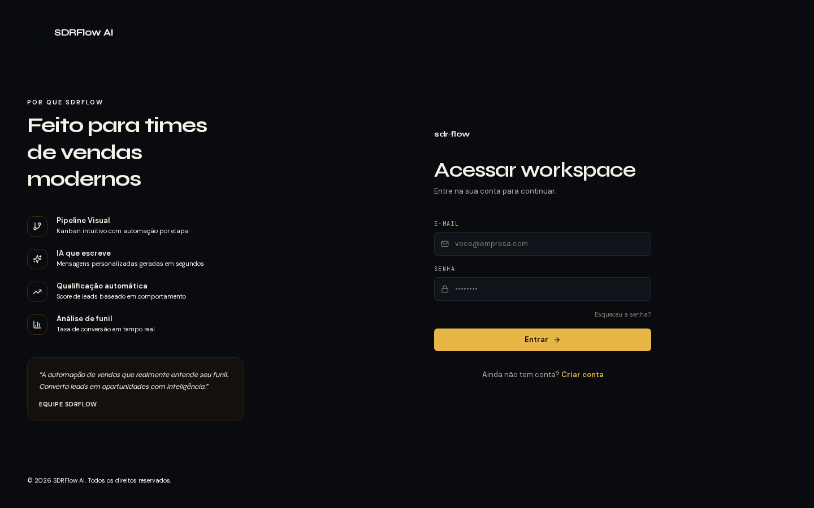

### Dashboard

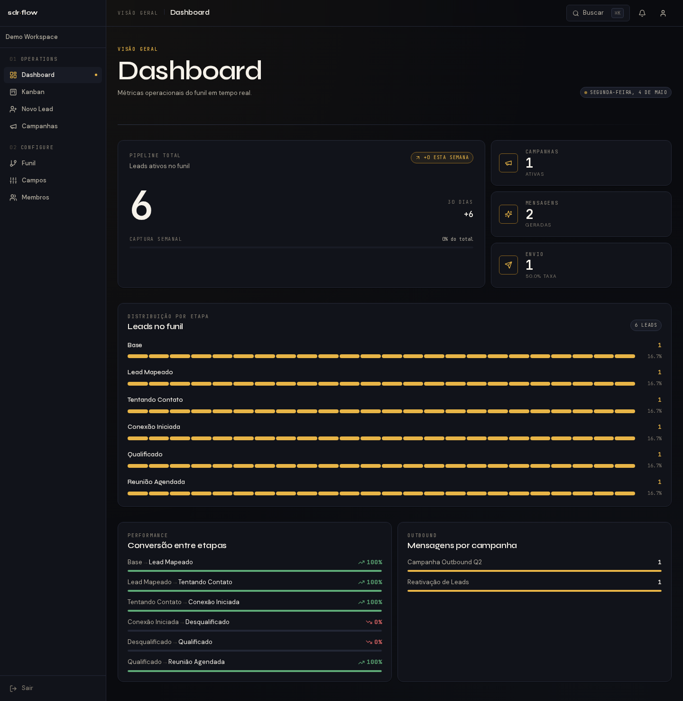

### Kanban

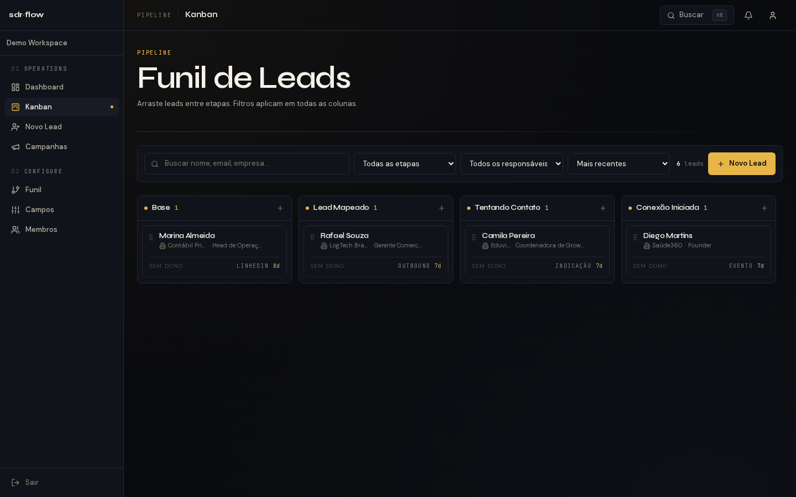

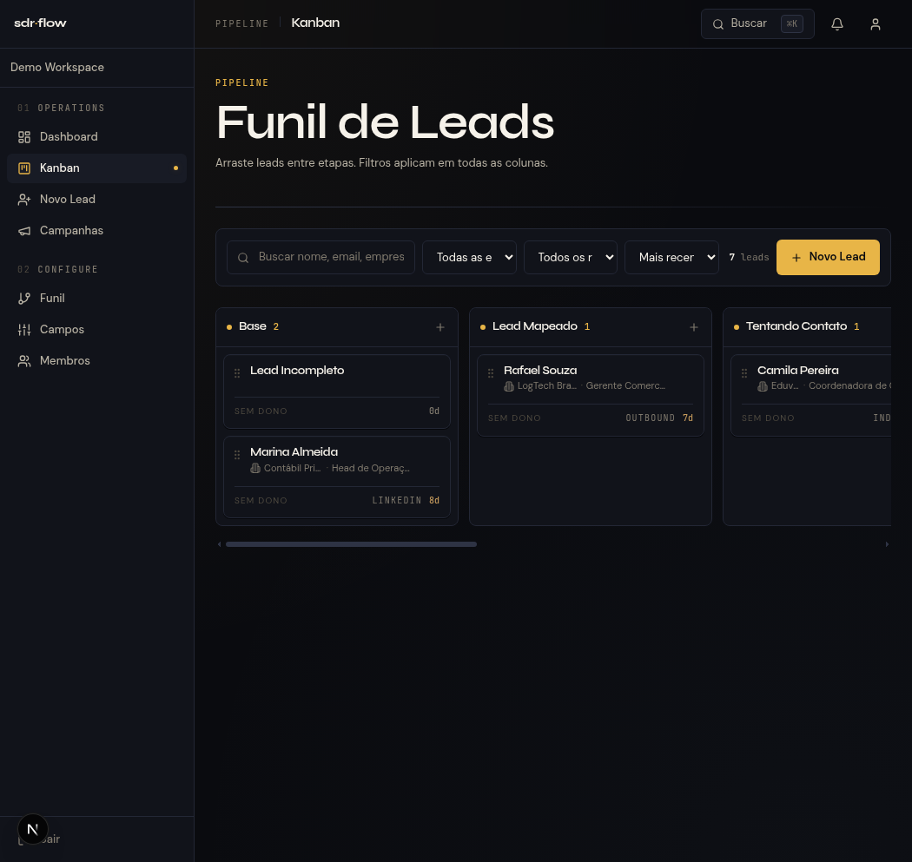

### Lead — detalhe e painel de IA

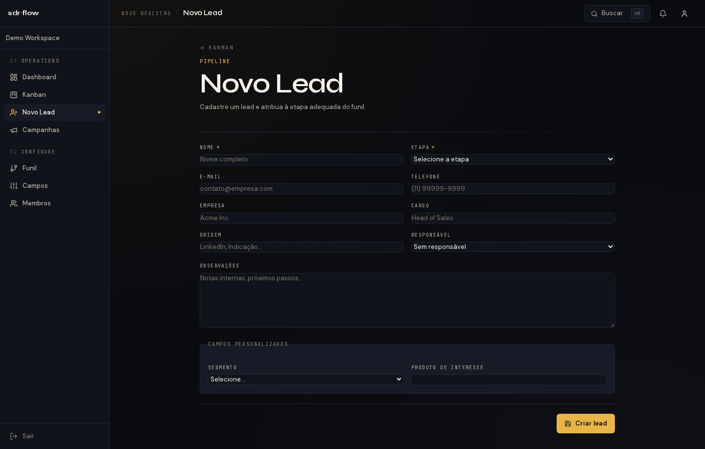

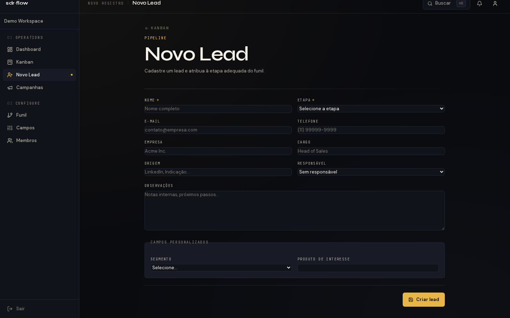

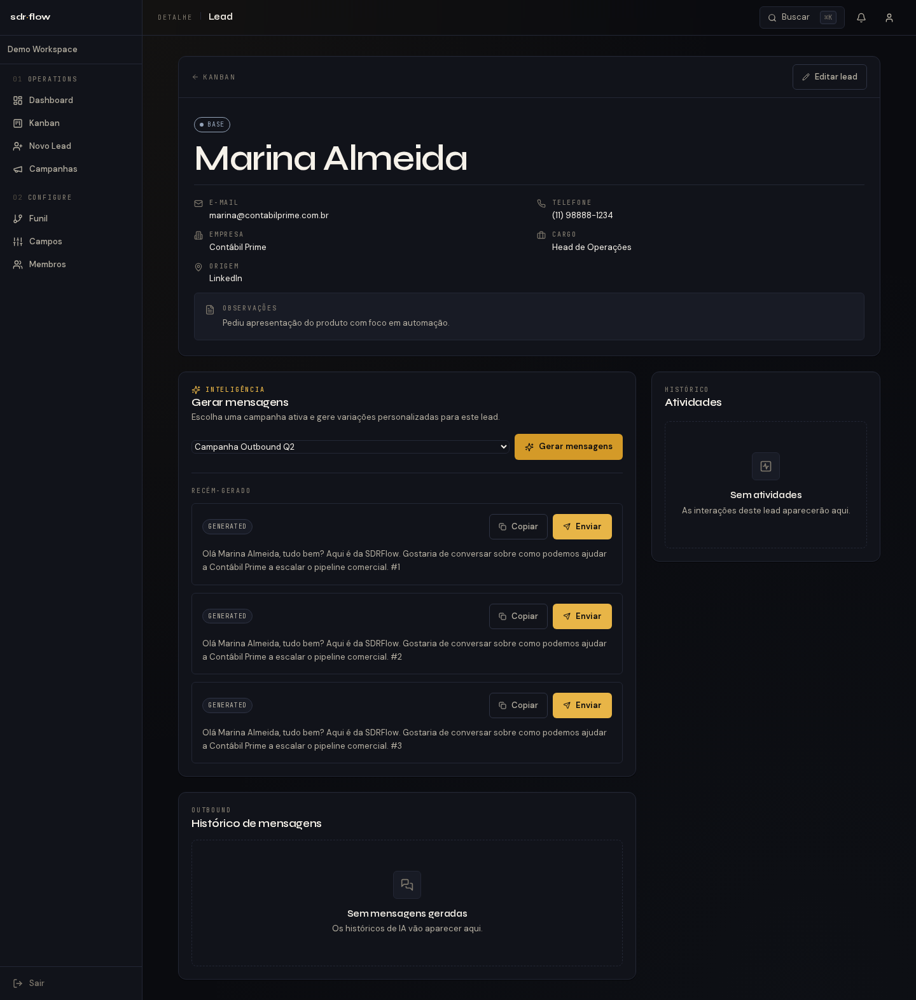

### Histórico de atividades

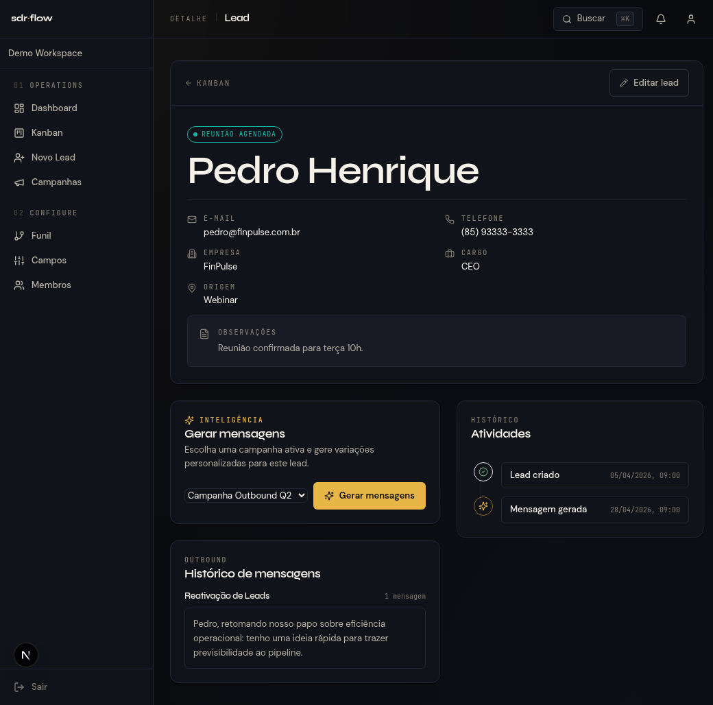

### Campanhas

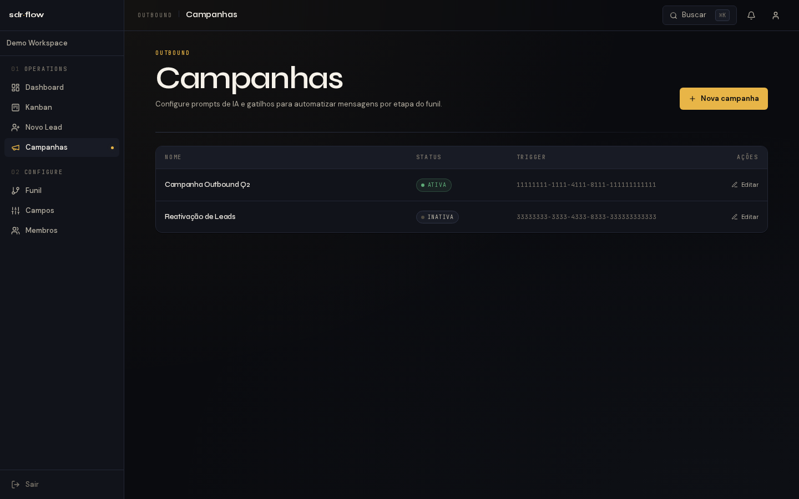

### Configurações

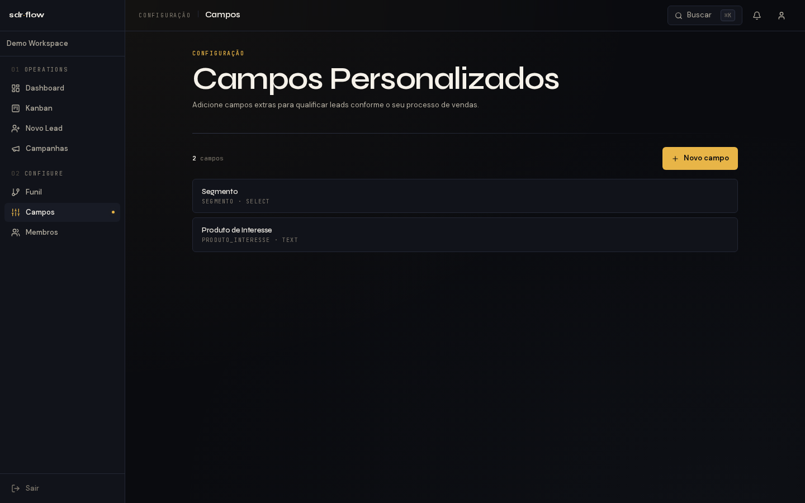

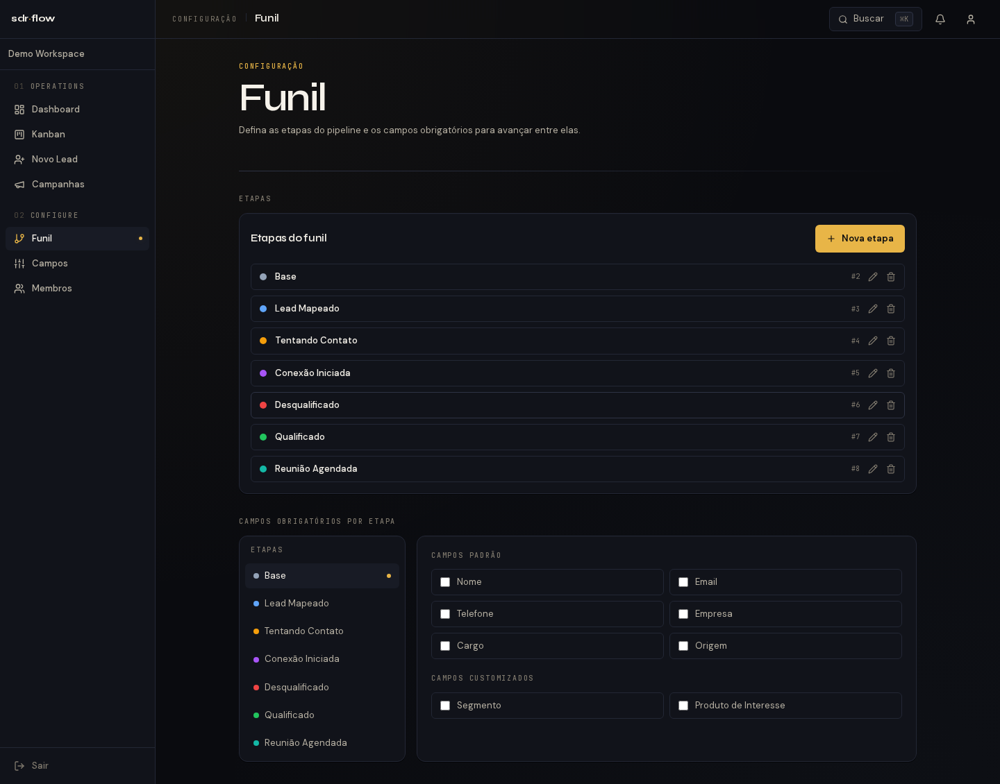
